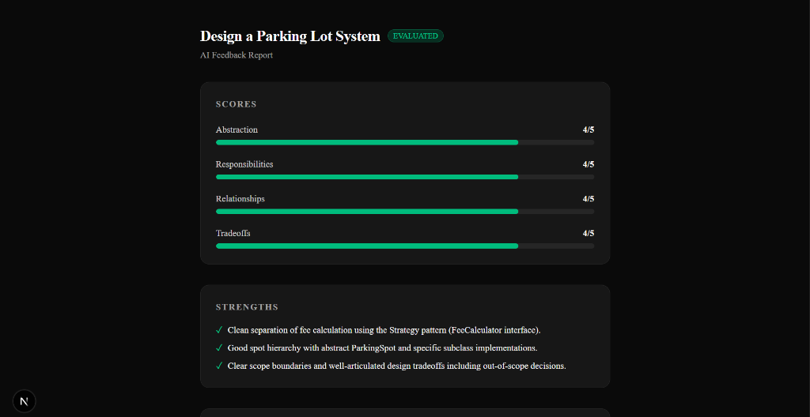
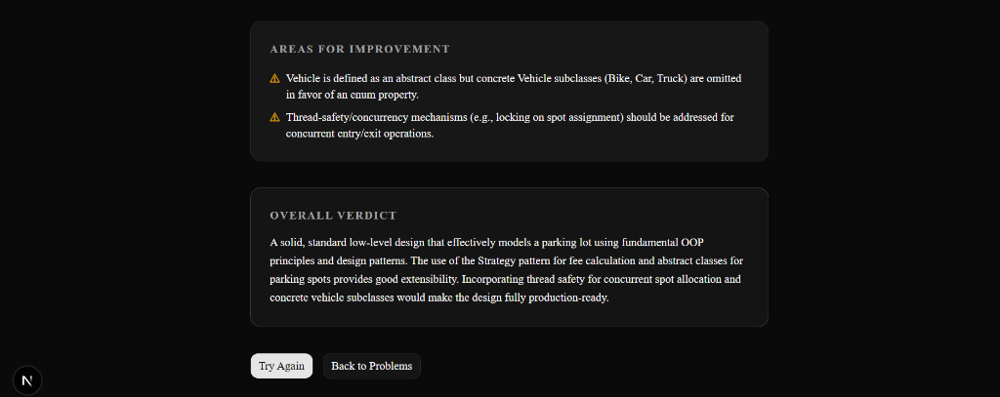

# LLD Arena

> A full-stack Low-Level Design practice platform with AI-powered feedback.

LLD Arena is a web application for practising Low-Level Design (LLD) problems. Write your solution in plain text, submit it, and receive scored feedback across four design dimensions — abstraction, responsibilities, relationships, and tradeoffs — generated by Google Gemini.

---

## Screenshots

**AI Feedback — Scores & Strengths**


**AI Feedback — Improvements & Overall Verdict**


---


## Tech Stack

| Layer | Technology |
|---|---|
| Framework | Next.js 15 (App Router) |
| Language | TypeScript |
| Styling | Tailwind CSS v4 + shadcn/ui |
| Database | PostgreSQL via Neon (serverless) |
| ORM | Prisma 7 |
| AI | Google Gemini (`gemini-3.6-flash`) |
| Tests | Vitest |

---

## Running Locally

### 1. Clone and install

```bash
git clone <your-repo-url>
cd lld-arena
npm install
```

### 2. Set environment variables

Create a `.env` file in the project root:

```env
DATABASE_URL="postgresql://..."
GEMINI_API_KEY="AIza..."
```

See [Environment Variables](#environment-variables) below for details on where to get each value.

### 3. Set up the database

```bash
# Apply migrations (creates all tables)
npx prisma migrate dev

# Seed with the 4 starter problems
npx prisma db seed
```

### 4. Start the dev server

```bash
npm run dev
```

Open [http://localhost:3000](http://localhost:3000).

---

## Environment Variables

| Variable | Required | Description |
|---|---|---|
| `DATABASE_URL` | ✅ | PostgreSQL connection string. Create a free database at [neon.tech](https://neon.tech) and copy the pooled connection URL. |
| `GEMINI_API_KEY` | ✅ | Google Gemini API key. Obtain one from [Google AI Studio](https://aistudio.google.com/app/apikey). |

---

## Project Structure

```
app/
  page.tsx                   # Problem list
  problems/[id]/page.tsx     # Attempt editor
  attempts/[id]/page.tsx     # Feedback viewer
  history/page.tsx           # Session history
  api/
    problems/route.ts        # GET  /api/problems
    attempts/route.ts        # POST /api/attempts
    attempts/[id]/route.ts   # GET  /api/attempts/:id
    history/route.ts         # GET  /api/history?sessionId=

lib/
  prisma.ts                  # Singleton Prisma client (PrismaPg adapter)
  domain/
    EvaluationStrategy.ts    # Interfaces: FeedbackResult, EvaluationStrategy
    GeminiEvaluationStrategy.ts  # Gemini implementation
    AttemptService.ts        # Orchestrates submission → evaluation → persist

prisma/
  schema.prisma              # Problem, Attempt, Feedback models
  seed.ts                    # 4 starter LLD problems

__tests__/
  AttemptService.test.ts
  GeminiEvaluationStrategy.test.ts
```

---

## Available Scripts

```bash
npm run dev          # Start development server
npm run build        # Production build
npm test             # Run tests (single pass)
npm run test:watch   # Run tests in watch mode
npm run test:coverage  # Run tests with coverage report
npx prisma db seed   # Re-seed the database (idempotent)
npx prisma studio    # Open Prisma database browser
```

---

## Key Decisions

### Strategy Pattern for AI evaluation
`AttemptService` depends on the `EvaluationStrategy` interface, not on Gemini directly. This means any evaluator (GPT-4, a rule-based mock, a human reviewer) can be swapped in without touching the submission logic. It also makes the service trivially testable with a mock evaluator.

### Separate score fields over a JSON blob
Each of the four scoring dimensions (`abstractionScore`, `responsibilitiesScore`, `relationshipsScore`, `tradeoffsScore`) is stored as an individual integer column rather than a single `JSONB` field. This preserves queryability — filtering or sorting attempts by any single dimension is a simple `WHERE` clause.

### Session-based identity without auth
Users are identified by a UUID stored in `localStorage` under `lld_session_id`. This avoids the complexity of authentication while still providing a personal history view. The trade-off is that clearing browser storage loses history.

### Simple FAILED status over retry queues
If the Gemini API call fails, the attempt is marked `FAILED` and the error is rethrown to the client. A message queue or retry mechanism was intentionally out of scope for this prototype. Users can re-submit if they encounter a transient failure.

---

## Known Limitations

- **No authentication** — history is per-browser-session only; clearing `localStorage` loses all history.
- **No pagination** — the `/api/problems` and `/api/history` endpoints return all records. Will need pagination as data grows.
- **Single evaluator** — only Gemini is wired up; the strategy pattern is in place but no UI exists to select an alternative.
- **No retry on AI failure** — a failed Gemini call marks the attempt as `FAILED` permanently; the user must re-submit manually.
- **Seed is destructive** — `npx prisma db seed` clears all attempts and feedback before re-seeding problems.
- **Scores are not validated** — Gemini is trusted to return integers 1–5; no server-side clamping is applied.
